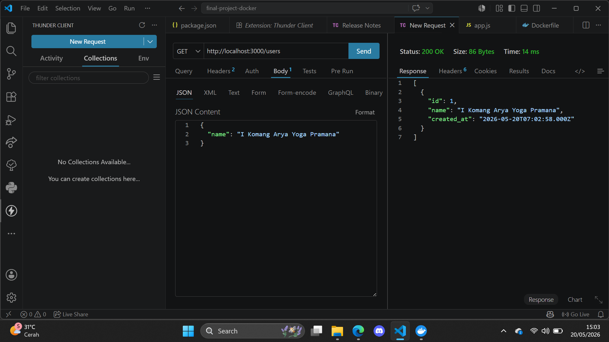
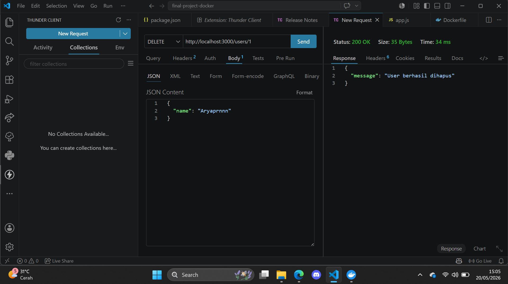
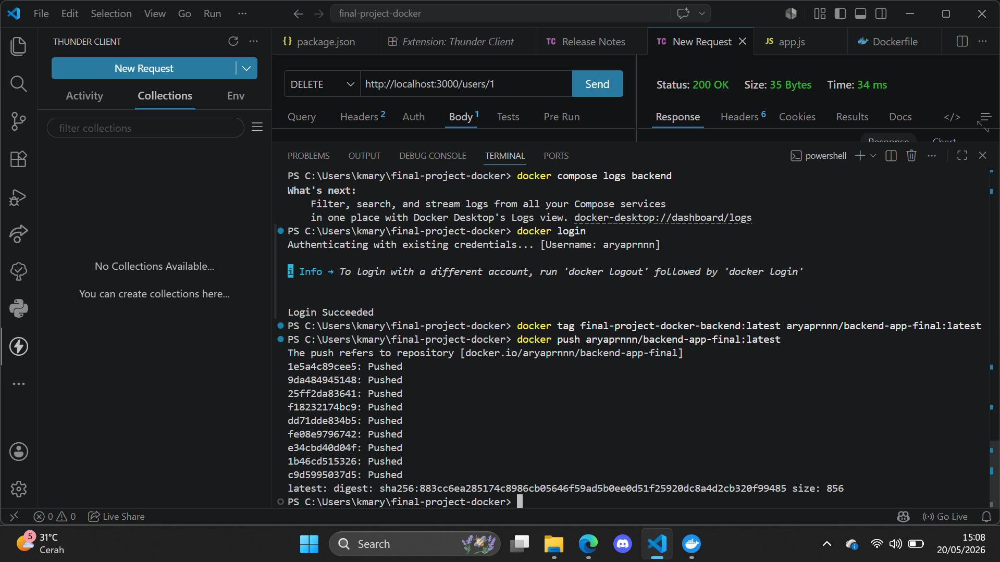
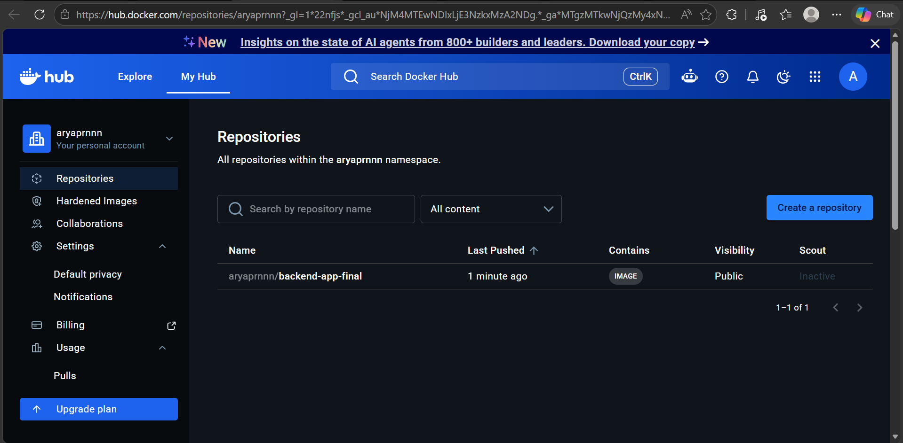

# Laporan Final Project - Kontainerisasi Aplikasi Backend dan Database dengan Docker

## Biodata Mahasiswa
- **Nama** : I Komang Arya Yoga Pramana  
- **NIM** : 2415354005  
- **Kelas** : 4A TRPL   

---

# 1. Arsitektur Sistem & Multi-Container

Project ini mengimplementasikan arsitektur **multi-container** yang memisahkan antara:
- **Backend Application** menggunakan Express.js (Node.js)
- **Database Server** menggunakan MySQL

Kedua service dijalankan secara terpisah menggunakan Docker Compose namun tetap saling terhubung melalui Docker Network internal bernama `final-network`.

Untuk memastikan backend tetap berjalan stabil saat database belum siap sepenuhnya, aplikasi backend menerapkan mekanisme:
* **Auto Retry Connection**
* **Waiting Database Initialization**
* **Dependency antar container**

Dengan mekanisme tersebut, backend tidak akan crash saat proses startup Docker Compose berlangsung.

---

# 2. Pengujian Docker Compose, Volume, dan Network

## Menjalankan Docker Compose
Project dijalankan menggunakan perintah berikut secara background:
```bash
docker compose up -d --build

```

**Keterangan:**

* `-d` → menjalankan container pada background (detached mode)
* `--build` → melakukan rebuild image sebelum container dijalankan

---

## Validasi Container & Koneksi Database

Untuk memastikan seluruh container berjalan dan backend berhasil terkoneksi ke MySQL setelah proses *retry connection*:

### Bukti Log Jalannya Container dan Validasi Koneksi Berhasil


---

# 3. Pengujian Endpoint CRUD API (Thunder Client)

Pengujian endpoint dilakukan menggunakan Thunder Client pada Visual Studio Code untuk memastikan seluruh operasi CRUD berjalan dengan baik.

---

## A. Create User (POST /users)

### Deskripsi

Menambahkan data user baru ke database MySQL.

### Request

```http
POST http://localhost:3000/users
Content-Type: application/json

```

### Body Request

```json
{
  "name": "I Komang Arya Yoga Pramana"
}

```

### Response (201 Created)

```json
{
  "message": "User berhasil ditambahkan",
  "id": 1
}

```

### Bukti Pengujian



---

## B. Read Users (GET /users)

### Deskripsi

Mengambil seluruh data user dari database.

### Request

```http
GET http://localhost:3000/users

```

### Response (200 OK)

```json
[
  {
    "id": 1,
    "name": "I Komang Arya Yoga Pramana",
    "created_at": "2026-05-20T07:02:58.000Z"
  }
]

```

### Bukti Pengujian


---

## C. Update User (PUT /users/:id)

### Deskripsi

Mengubah data user berdasarkan ID tertentu.

### Request

```http
PUT http://localhost:3000/users/1
Content-Type: application/json

```

### Body Request

```json
{
  "name": "Aryaprnnn"
}

```

### Response (200 OK)

```json
{
  "message": "User berhasil diupdate"
}

```

### Bukti Pengujian


---

## D. Delete User (DELETE /users/:id)

### Deskripsi

Menghapus data user berdasarkan ID.

### Request

```http
DELETE http://localhost:3000/users/1

```

### Response (200 OK)

```json
{
  "message": "User berhasil dihapus"
}

```

### Bukti Pengujian



---

# 4. Publikasi Image ke Docker Hub

Sebagai tahap akhir deployment container, image backend berhasil dipublikasikan ke Docker Hub agar dapat digunakan kembali secara global.

## Repository Docker Hub

```text
[https://hub.docker.com/r/aryaprnnn/backend-app-final](https://hub.docker.com/r/aryaprnnn/backend-app-final)

```

## Pull Image

```bash
docker pull aryaprnnn/backend-app-final:latest

```

---

## Perintah Publikasi Image

### 1. Login Docker Hub

```bash
docker login

```

### 2. Build & Tag Docker Image

```bash
docker tag final-project-docker-backend:latest aryaprnnn/backend-app-final:latest

```

### 3. Push Docker Image

```bash
docker push aryaprnnn/backend-app-final:latest

```

---

## Bukti Push Docker Hub (Terminal Log)

Berikut adalah bukti log terminal ketika seluruh layer berhasil terunggah ke registry Docker Hub:



---

## Bukti Dashboard Repositori Docker Hub

Menampilkan dashboard akun Docker Hub yang memvalidasi bahwa repository `backend-app-final` telah aktif dan menerima push terbaru:



---

# 5. Struktur Project

```bash
final-project-docker-2415354005/
│
├── app/
│   ├── Dockerfile
│   ├── .dockerignore
│   ├── .env
│   ├── package.json
│   └── app.js
│
├── docker-compose.yml
└── README.md

```

---

# 6. Teknologi yang Digunakan

* Node.js
* Express.js
* MySQL
* Docker
* Docker Compose
* Thunder Client
* Docker Hub

---

# 7. Kesimpulan

Berdasarkan hasil implementasi dan pengujian yang telah dilakukan, dapat disimpulkan bahwa:

* Aplikasi multi-container berhasil dijalankan menggunakan Docker Compose tanpa mengalami crash saat startup.
* Backend Express.js berhasil terhubung dengan database MySQL menggunakan Docker Network internal (`final-network`).
* Seluruh endpoint CRUD API (POST, GET, PUT, DELETE) berjalan dengan sukses dan memanipulasi database dengan benar.
* Image aplikasi berhasil di-tagging dan dipublikasikan ke Docker Hub registry cloud secara global.
* Penggunaan environment variable berhasil diterapkan melalui file `.env` untuk mengamankan kredensial sistem.

```
